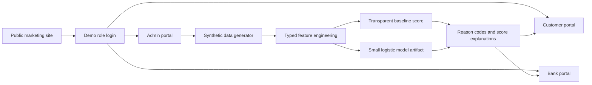

# CredAI

CredAI is an interactive fintech prototype for transparent alternative credit intelligence in Pakistan. It demonstrates how synthetic utility, telecom, wallet, cash-flow, and repayment behavior can be transformed into explainable decision-support signals for customers, banks, and platform administrators.

[](https://cred-ai-giki.vercel.app/)

> Prototype status: CredAI is not production lending software. It uses synthetic data and demo authentication only. It does not provide a real credit score, financial advice, loan approval, or credit decision. Do not enter real CNICs, financial records, passwords, OTPs, tokens, or private account information.

## Product surfaces

- Public website: `/`, `/how-it-works`, `/for-customers`, `/for-banks`, `/security`, `/about`, `/contact`
- Demo auth: `/login`, `/register`
- Customer portal: `/customer/dashboard`, `/customer/score`, `/customer/data`, `/customer/data-sources`, `/customer/loans`, `/customer/loans/apply`, `/customer/activity`, `/customer/settings`, `/customer/help`
- Bank portal: `/bank/dashboard`, `/bank/applications`, `/bank/applications/[id]`, `/bank/applicants`, `/bank/applicants/[id]`, `/bank/portfolio`, `/bank/decisioning`, `/bank/model`, `/bank/audit`, `/bank/settings`
- Admin portal: `/admin`, `/admin/dashboard`, `/admin/users`, `/admin/organizations`, `/admin/data-sources`, `/admin/synthetic-data`, `/admin/models`, `/admin/models/[id]`, `/admin/training`, `/admin/fairness`, `/admin/audit`, `/admin/settings`

Legacy routes `/dashboard`, `/loan/apply`, `/loan/upload`, and `/onboarding` remain compatible through redirects or updated demo screens.

## Demo accounts

| Role | Login | Password | Landing route |
| --- | --- | --- | --- |
| Customer | `customer` | `demo1234` | `/customer/dashboard` |
| Bank analyst | `analyst` | `demo1234` | `/bank/dashboard` |
| Bank manager | `manager` | `demo1234` | `/bank/dashboard` |
| Admin | `admin` | `123456` | `/admin/dashboard` |

See `docs/credai-rebuild/demo-accounts.md` for the full list, including legacy demo accounts.

## Architecture



Key files:

- `src/lib/credai-data.ts` — deterministic synthetic profiles, applications, audit events, dataset summary, and formatting helpers.
- `src/lib/permissions.ts` — central role and permission map for customer, bank analyst, bank manager, and admin roles.
- `src/lib/scoring/` — feature definitions, baseline score, logistic inference, explanations, model registry, and checked-in artifact.
- `src/components/portal/` — public marketing pages, portal shells, score cards, dashboard panels, application tables, and admin views.
- `scripts/` — reproducible synthetic-data, model-training, model-evaluation, and deterministic test commands.
- `docs/credai-rebuild/` — discovery, product, architecture, data dictionary, model card, demo accounts, compliance notes, and QA checklist.

## Scoring model

CredAI includes two scoring paths:

1. Transparent baseline scorecard using these category weights:
   - Repayment behavior: 30%
   - Utility payment consistency: 15%
   - Wallet cash-flow stability: 20%
   - Telecom continuity: 10%
   - General financial stability: 15%
   - Account tenure: 5%
   - Data completeness: 5%
2. Small logistic regression artifact for `simulated_repayment_success`, trained only on synthetic features and mapped to the 300–850 demo score range.

The model excludes protected attributes and obvious proxies. Synthetic audit groups are used only for fairness diagnostics, not as model inputs.

## Local commands

Requirements: Node.js 20+ and npm.

```bash
npm install
npm run dev
npm run lint
npm run typecheck
npm run test
npm run data:generate
npm run model:train
npm run model:evaluate
npm run build
```

## Verification notes

The Qoder shell used during this rebuild did not expose `node` or `npm` on PATH, so npm commands may need to be run in a local terminal with Node.js installed. `git diff --check` is used for whitespace validation when npm is unavailable.

## Production work still required

Before real use, replace demo authentication with production authentication, move data access to a secure backend, implement encrypted persistence, perform privacy/security/credit-law reviews, validate models on representative real-world data, define governance and monitoring, and complete accessibility and usability testing with target users.

## License

MIT. See `LICENSE`.
