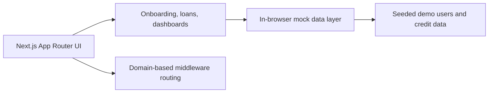

# CredAI

An interactive fintech prototype exploring alternative credit scoring, borrower onboarding, loan applications, and role-based dashboards for Pakistan.

[](https://cred-ai-giki.vercel.app/)

> **Prototype status:** CredAI is a portfolio and coursework demonstration, not a production lending system. It uses in-browser mock data and demo authentication. Do not enter real financial, identity, or password data.

## Highlights

- Borrower registration and onboarding flows
- Credit-profile and loan-application experiences
- User and administrator dashboards
- Responsive interface with motion and reusable components
- Domain-based routing for the deployed demo
- Seeded mock data for repeatable demonstrations

## Live demo

Visit **[cred-ai-giki.vercel.app](https://cred-ai-giki.vercel.app/)**.

Use only fictional information. The current build stores demo state in the browser and does not provide production-grade authentication or persistence.

## Tech stack

- Next.js 16 and React 19
- TypeScript
- Tailwind CSS
- Radix UI primitives
- Framer Motion
- Recharts
- Vercel

## Architecture



Key areas:

- `src/app/` — pages and route groups
- `src/components/` — shared interface components
- `src/lib/db.ts` — mock data and demo authentication
- `src/middleware.ts` — domain-based routing
- `public/` — static assets

## Run locally

Requirements: Node.js 20+ and npm.

```bash
git clone https://github.com/M-Nabeegh/cred-ai-giki.git
cd cred-ai-giki
npm install
npm run dev
```

Open [http://localhost:3000](http://localhost:3000).

## Validation

```bash
npm run lint
npm run build
```

## Roadmap to production

Before using this beyond a demo, replace the mock data layer with a secured backend, hash credentials server-side, add authorization checks, validate all inputs, add automated tests, complete a privacy/security review, and document the credit-scoring methodology and fairness safeguards.

## License

No open-source license has been selected yet. The source is public for portfolio review; reuse rights are not granted automatically.
